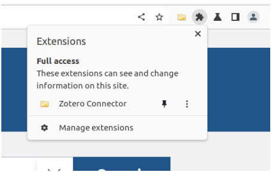
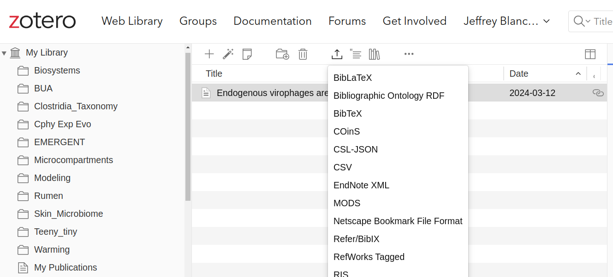

## Learning objectives

* Adding references to a Rmarkdown document
* Getting set up with Zotero

## Adding references to your Rmarkdown report

You can automatically generate citations and a bibliography in a number of styles. In order to use this feature, you will need to specify a bibliography file using the bibliography metadata field in a YAML metadata section. For example:

```
---
title: "Sample Document"
output: html_document
bibliography: bibliography.bib
---
```

You can export references from your favorite reference manager. I use the open source [Zotero](www.zotero.org).

### Minimum working example

If you create this two files paper.Rmd and references.bib you will have a working example to build from
paper.Rmd

```
---
title: 'My Title'
author: "Me me me me!"
date: Aug 31, 2020
output: html_document
bibliography: references.bib
---

Application written in R [@RCoreTeam] using the Shiny framework [@Chang2015].

# REFERENCES
```

references.bib (Make this file as a text file (File -> New File -> text file))

```
@Misc{Chang2015,
  Title                    = {shiny: Web Application Framework for R. R package version 0.12.1},

  Author                   = {Chang, W. and Cheng, J. and Allaire, JJ. and Xie, Y. and McPherson, J. },
  Year                     = {2015},

  Type                     = {Computer Program},
  Url                      = {http://CRAN.R-project.org/package=shiny}
}


@Article{RCoreTeam,
  Title                    = {R: A Language and Environment for Statistical Computing},
  Author                   = {{R Core Team}},
  Year                     = {2015},

  Type                     = {Journal Article},
  Url                      = {http://www.R-project.org}
}
```

Here is a short example of a manuscript style report [Reproducible Papers with RMarkdown](https://nceas.github.io/oss-lessons/reproducible-papers-with-rmd/reproducible-papers-with-rmd.html)

## Zotero

Zotero is a free and opens-source project that I have been using for the last 15 years. I think of Zotero in 3 parts; a group reference database that I share with collaborators, a tool integrated with my web browser to easily import references and a tool integrated with my preferred software for writing (e.g. LibreOffice, Google Docs, Word).

### Zotero Groups

Go to [Zotero Groups](https://www.zotero.org/groups/) and register for an account. Once you have logged in, one person in your class project group should create a new group. It can be either a private or public group. If it is a private or closed public group invite other members of your project team to the group. Select the default to give all members of your project team the ability to edit.

Once you have created your new group. Go to the [Zotero homepage](https://www.zotero.org/) and click on the menu tab `Web Library`.  You should be able to see the new group in your `Web Library`.

### Populating your Zotero Web Library

Download the [Zotero connector](https://www.zotero.org/download/) for your web browser. 

Go to [Pubmed](https://pubmed.ncbi.nlm.nih.gov/) one of the best sources researching the life sciences and biomedical literature. Search for a term (e.g. virophage). Click on the extensions icon in your web browser.



Select the box(es) for the references you want to import.  You should now see them in your Zotero Web Library. If they are not yet in your group library move them to share with other members of your project team.

### Creating the .bib reference file for use in your Rmarkdown file

Go to your Zotero Web Library. Select the references you want to export. Click on the export icon.



Save the references in BibText format. This should create a `.bib` file. Upload this file into your working directory on Posit Cloud. Add the name of the file (e.g. references_virophage.bib) to your YAML block

```
---
title: "Lab 11 : References in RMarkdown and Getting started with Zotero"
output:
  html_document:
    toc: true
    toc_depth: 4
    theme: united
    highlight: tango
bibliography: references_virophage.bib
---
```

Cite the references in our document.Virophages integrated into host genomes can be activated and inhibit giant virus infection [@koslova_endogenous_2024].  I am going to create a RShiny app [@Chang2015].

### Integrated Zotero with other software for creating documents

You will not need to do this for this course, but to have the Zotero Library installed on your computer download the [Zotero version](https://www.zotero.org/download/) for your computer. Then download the plugin for your writing sofware (e.g. LibreOffice, Google Docs, Word).

### Exercises

Add references related to your project to your Lab 10 report and turn it in as Lab 11.

## References
