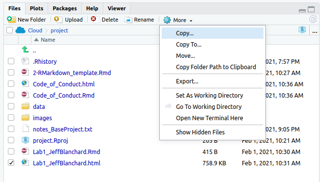

## Learning objectives

-   Become aware of the field of computational advanced genetics
-   Install and run R packages on your computer
-   Use KnitR to generate a html file of your lab report
-   Basic computation in R
-   How to create and compute with vectors
-   Simple Graphs

## Overview

In recent years, the field of genomic analysis has sifted towards requiring some knowledge of R, Python/Perl/C and the use of high performance computers (often requiring some fundamental Unix skills) available at national computing centers for working with large data sets. While there are many great software packages available for particular computational problems in evolutionary biology, many software programs do not have a user interface (e.g. drop down menus and such) and are run in command line mode. The lab sessions in this course have been designed to give students an introduction to working with R, Python and the Unix command line in addition to learning some standalone software packages.

### What is Bioinformatics?

Bioinformatics is the field of science in which biology, computer science, statistics and information technology merge into a single discipline. There are three important sub-disciplines within bioinformatics:

-   The development of new algorithms and statistics with which to assess relationships among members of large data sets.
-   The development and implementation of tools that enable efficient access and management of different types of information.
-   The analysis and interpretation of various types of data including nucleotide and amino acid sequences, protein domains, and protein structures.

### Bioinformatics...

-   is a term coined in response to the high demand of techniques and resources for handling the explosion of molecular data.
-   is a buzzword to describe a growing field.
-   benefits from the physicists, chemists and mathematicians crossing over into biology.
-   is a collection of tools.
-   is way of thinking about a problem.

### The Development and Implementation of Tools

In order to make new algorithms and data sources available to biologists someone needs to write applications that include these algorithms and create new databases. Often this is first done by academic research groups. Later redone by private companies when market is large and profitable enough. There is a large gap between what is done by research groups and companies. Sometimes this is filled by large government funded projects, but not usually in time for most researchers. This is why bioinformatics and programming skills have become very valuable.

### Data Science

-   <a href="https://datascience.berkeley.edu/about/what-is-data-science/"target="_blank">What is Data Science? </a>\
-   <a href="https://blog.udacity.com/2014/11/data-science-job-skills.html"target="_blank">What is Data Science? 8 Skills That Will Get You Hired</a>\
-   <a href="https://www.nceas.ucsb.edu/news/open-science-kinder-science"target="_blank">Open Science is Kinder Science</a>\
-   <a href="https://datacarpentry.org/"target="_blank">Data Carpentry</a>\
-   <a href="https://journals.plos.org/plosbiology/article?id=10.1371/journal.pbio.2005561"target="_blank">Building a local community of practice in scientific programming for life scientists</a>

### Computer Operating Systems

Most everything we do in this course can be done in Windows, Apple's OS X, Linux and Unix and on most laptop computers sold in the past few years. One of the goals of this course is for you to be able to set up an environment to program and run R on your own computer or the computers in your research laboratory. There will be several labs that we use virtual machines (VMs) to access high performance computers from your computer desktop.

### Open Source Software

The Open Source movement treats program source code in a similar manner to the way scientists publish their results: publicly and open to unfettered examination and discussion. Examples include:

-   Linux operating system
-   Firefox web browser
-   Python
-   R
-   BioPerl, BioJava, BioPython
-   EMBOSS, Bioconductor, Cytoscape, and many of the programs we will use in bioinformatics.

We can also look at the code to see how they solved they problem, what algorithms they used and even use the code in our programs as long as we properly acknowledge the source.

## R

R is the largest and most comprehensive public domain statistical computing environment. The core R package is enhanced by several hundred user-supplied add-on packages, including many for gene expression analysis, in the <a href="http://cran.r-project.org/"> Comprehensive R Archive Network (CRAN)</a>. Omegahat Project for Statistical Computing</a>. <a href="http://www.bioconductor.org/"> BioConductor</a> is an open source and open development software project for the analysis and comprehension of genomic data and is based primarily on the R programming language. R and Bioconductor are free, Open Source and available for Windows, MacOS and a wide variety of UNIX platforms.

### R manuals, help and tutorials

Many introductory and advance tutorials have been developed for R. Here are a few

-   <a href="http://cran.r-project.org/manuals.html#R-admin" target="_blank">The offical R manuals</a>
-   <a href="http://cran.r-project.org/doc/manuals/R-intro.html" target="_blank">CRAN's Introduction to R</a>
-   <a href="https://r4ds.had.co.nz/" target="_blank">R for Data Science</a> by Garrett Grolemund and Hadley Wickham
-   <a href="http://www.cookbook-r.com/Graphs/" target="_blank">R Graphics Cookbook</a> by Winston Chang
-   <a href="https://github.com/datacarpentry/genomics-workshop/" target="_blank">Data Carpentries Genomic Workshop Sessions</a>
-   <a href="https://datacarpentry.org/R-ecology-lesson/index.html" target="_blank">Data Analysis and Visualization in R for Ecologists</a>

There are also many workshops and online R courses that you could take to follow up what you learn in this class.

### Unity Bioinformatics Slack Channel

Unity is the UMass High Performance Computing cluster. Unity staff maintain a Slack channel for help to solves bioinformatics-related issues. To join the Unity Slack community, please sign up with your UMass email [here](https://join.slack.com/t/unity-user-community/signup). If you're unable to register with your school email, please contact [hpc\@umass.edu](mailto:hpc@umass.edu){.email} with your preferred email address and we'll send you a direct invite.

## Getting set up

### Bio476 and Bio676

[Posit Cloud](https://posit.cloud/) and create an account. I will share the link for our Workspace in an Announcement on Canvas. The steps are

-   Click on Link in Canvas
-   Join EvoGeno Workspace
-   Under your spaces select EvoGeno Workspace
-   Click on Project tab
-   Start assignment

### Bio676

If you are a graduate student in 676 please set up an account (you will need your PIs approval) on Unity <https://unity.rc.umass.edu/>. You will be using R and RStudio from the Unity HPC. You are also welcome to use R and RStudio it from your own computer.

### Working in RStudio

1. Open RStudio

2. Click on File > New File > RMarkdown

The default R studio appearance includes 4 windows. 

1. The R script(s) and data view.
2. Console.
3. Workspace and history.
4. Files, plots, packages and help.


#### Console Window (bottom left window)

The console is where you can type R commands and see output.

Type

3 + 3

#### The R script(s) and data view window (upper left window)

In this window you can type directly into a file, run code and save the file for reuse. In this class we will mostly work with R Markdown and R files (discussed below)

#### Workspace and History tabs (upper right window)

The workspace tab shows all the active objects. The history tab shows a list of commands used so far.

#### Files, Plots, Packages and Help (bottom right window)

There are data sets that come with the R package and used in tutorials. If you run the following command you will see a graph of related to the cars data set in the Plots window

#### Basic set up of RStudio

In the menu go to Tools \> Global Options.

There are a number of ways to customize your RStudio set up. **For this class, I recommend not saving your workspace as a `.RData` file and if you do then not restoring it on start up.** You can also change the appearance and colorization of RStudio.

## Basic computation

R can be used as an ordinary calculator. Here are a few examples:

```{r}
3 * 3
```

Note order of operations

```{r}
3 + 3 / 3
```

Where

```{r}
(3 + 3) / 3
```

Here are a few other simple computations

```{r}
    log (10)       # Natural logarithm with base e=2.718282
    exp(2)         # exponential function
    3^3            # 3 raised to the third power
    sqrt (9)       # Square root
    abs (1-7)      # Absolute value of 1-7
```

### Assignment statements

All R statements where you create objects are called assignment statements and the form "object_name \<- value"

```{r}
x <- 3
```

Simply typing x will give the value of x

```{r}
x
```

You will make lots of assignments and \<- is a pain to type. Instead, use RStudio's keyboard shortcut: Alt + - (the minus sign). Notice that RStudio automagically surrounds \<- with spaces, which is a good code formatting practice. An equals sign = will work in place of \<-, but it will cause confusion later so keep to the convention of using \<- to make assignments

### Object Names

Object names must start with a letter, and can only contain letters, numbers, underscores and periods. You want your object names to be descriptive, so you'll need a convention for multiple words. I recommend snake_case where you separate lowercase words with an underscore. Note that R is case sensitive, e.g., object names gene, GENE, Gene are all different.

```{r}
my_genome_size <- 3100000000
```

**Important note:** since there are many built-in functions in R, make sure that the new object names you assign are not already used by the system. A simple way of checking this is to type in the name you want to use. If the system returns an error message telling you that such object is not found, it is safe to use the name. For example, c (for concatenate) is a built-in function used to combine elements so NEVER assign an object to c!

### R data types

There are 5 basic data types in R

-   Numeric
-   Integer
-   Logical
-   Character
-   Complex

#### Numerics

Decimal values are called numerics in R. It is the default computational data type.\
For instance

```{r}
x <- 3.5
```

Simply typing x will give the value of x

```{r}
x
```

or you can compute with x

```{r}
sqrt(x)
```

#### Integers

In order to create an integer variable in R, invoke the as.integer function

```{r}
x <- 3.33
y <- as.integer(x)
y
```

#### Logical

A logical value is created by comparison between variables.

```{r}
x <- 1
y <- 2 
z <- x > y 
z   
```

Standard logical operations are "&" (and), "\|" (or), and "!" (negation).

```{r}
x <- TRUE
y <- FALSE 
x & y
```

```{r}
x | y 
```

```{r}
!x
```

#### Character

A character object is used to represent string values in R. It is defined by double quotes "".

```{r}
DNA <- "ATGAAA"
DNA
```

We will learn more about working with strings in subsequent labs.

#### Complex

We will not work with complex numbers in our labs, but for completeness. A complex value in R is defined by the imaginary value i.

```{r}
x <- 1 + 2i 
x
```

### Vectors

A vector is a sequence of data elements of the same basic type. data elements in a vector are officially called components. Assignment operator (\<-) stores the value (object) on the right side of (\<-) expression in the left side. Once assigned, the object can be used just as an ordinary component of the computation. The c function concanenates the components into a vector.

```{r}
x<- c(1,10,100)    
x
```

Now you can do scalar computations on a vector

```{r}
x * 2
```

or use sum, sort, min, max, length and many other operations. For example

```{r}
sum (x)
```

You can also do vector arithematic

```{r}
x<- c(1,10,100) 
y<- c(1,2,3) 
x * y
```

Vectors can also be made of characters

```{r}
codons<- c("AUG", "UAU", "UGA") 
codons
```

## Producing Lab Reports with RMarkdown and knitr

So far you have been typing your commands directly into the console. One key to reproducibile research is sharing your code and results with other scientists. One popular way to do this is to make a report that includes both using the RMarkdown language and the knitr R package.

RMarkdown is a simple syntax similar to the markup styles used in Wikis.There are several important differences between working with .R and Rmd files. Please take 10 minutes to go through the intro at <https://rmarkdown.rstudio.com/>.

You can create a new .Rmd file through the menu File \> New File \> RMarkdown. This generates and example file which you can edit. Test to make sure your computer is set up to work with .Rmd files by clicking on knit to generate a .html version of this file. This will automatically be saved in your working directory. The .html file can be openned in any browser (e.g. Firefox)

### Lab Reports

Lab Reports will be made using the RMarkdown notation. To make a Lab Report

-   Open File > New File > Rmarkdwon
-   Change the title (e.g. Lab 1) and add your name as the author. Select html as the Default Output Format.
-   Save the files as something like yourname_lab1.Rmd
-   Delete all of the file below line 7
-   Start coding!
-   When you are done Knit the file to generate a .html file (this is automatically saved into the same folder as the .Rmd file).

## Exercises

### Exercise 1

For x = 3 and y = 15, compute the sum, difference, product and quotient of x and y

### Exercise 2

For x = 2 and y = 3, Test x\^5 is greater than y\^4 and return a logical value

### Exercise 3

Create a vector of the values 22, 62, 148, 43 and 129. Determine the sum of the vector. Divide each value in the vector by the sum to determine relative frequency.

### Exercise 4

Create a vector of the nucleotides A, T, C and G. Sort the vector.


### What to turn in?

-   If you are working on Poist Cloud or the Unity You will need to first export the your Lab1_yourname.html file to your computer.

 \* Then upload the file to Canvas
