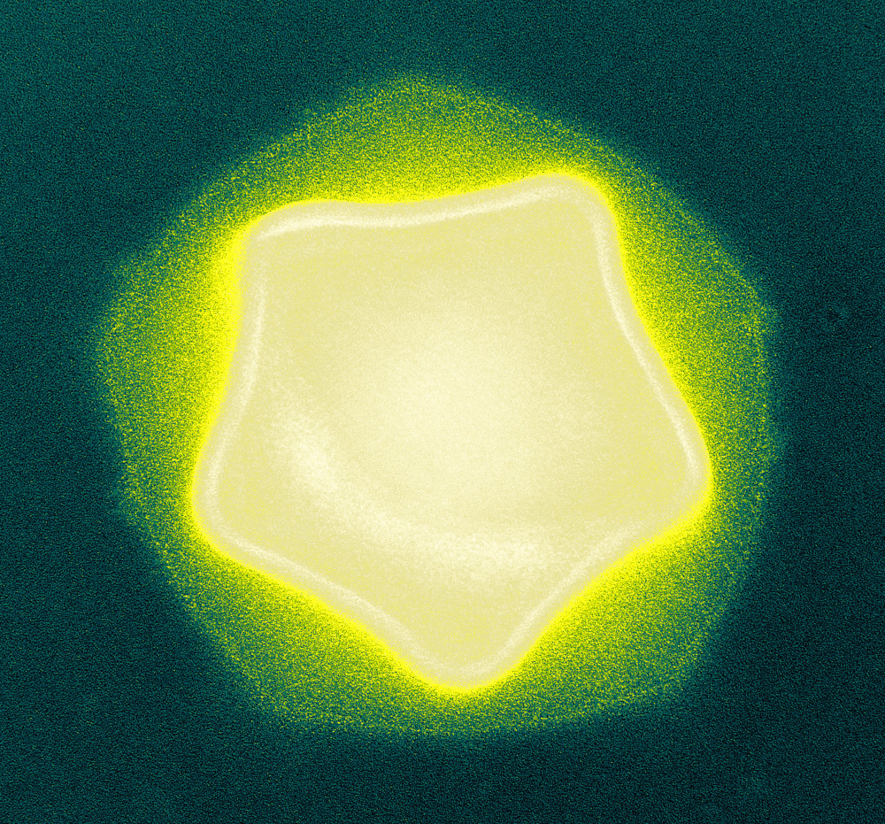

## Learning objectives

-   Learning more about R Markdown
-   Loading images
-   YAML block

## Overview and examples

### A more comprehensive look at R Markdown

In Lab one we used a single R Markdown file to both save and execute code and generate a lab report. Today we will spend more time understanding R Markdown using a set of [R Markdown tutorials](https://rmarkdown.rstudio.com/index.html)

### RMarkdown loading images

Images liven up presentations and reports. They can help broaden the appeal or be from the results of other analysis outside of R. Upload your image to your working directory (often it is useful for better organization to have a separate folder called `images`).  Upload png, jpeg and other supported images types to this folder. The key think to remember is this below line of code does NOT go into a R code chunk. It is part of the Rmarkdown sections of the report. The legend goes between the `[ ]` square brackets. The file name (and path to the file) goes between the `()` round brackets.

### YAML

The very top of your Rmarkdown default template is the `YAML` block which is bordered by `---`

You already now the title, author, data and hmtl output sections which were in your Lab 1 report.  The toc is for table of contents. The depth is the number of subheaders recognized. The toc_float option is to float the table of contents to the left of the main document content (the default is false for putting it at the top of the document). Here is a good overview with a different themes - https://bookdown.org/yihui/rmarkdown/html-document.html

## Exercises

### Exercise 1

Create an example lab report that includes

1. A title, your name and date
2. Output in html with a table of contents, theme and highlighting different from the example and the code hidden (but shown with a button).
3. An image
4. At least 3 levels of headers in the main section of your text
5. The code from the exercises for Lab 1

