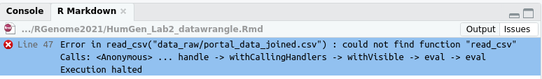

## Learning objectives

-   Understanding R packages and libraries
-   Reading and manipulating tables with tidyverse
-   Making nice tables for your lab reports


### Basic data types and data objects

The last lab we learned about data types in R and vectors, one of the most important object types in R. This session we will more in data types and objects

Vectors are ordered collections of the same data type (numeric, character, complex, raw and logical values). You can assemble and combine vectors using the function "c" short for combine. As we saw last week it matters as to whether you have parenthesis around your data. To check on an object type use `str`

```{r}
x <- c(1, 2, 3, 4)
str(x)
```

If we use parentheses

```{r}
a <- c("1", "2", "3", "4")
str(a)
```

The numbers are read into the vector as characters. It is important to also note the distinction between reading data objects vs characters. A common error is for people to read in characters but forget the parentheses

```{r, eval=FALSE}
b <- c(ATG, TGA)
```

This will results in `object 'ATG' not found`


In the following example, there are 3 levels (AA AG GG). The Environment window in the top right corner of RStudio will also display the value types.


## R packages and libraries

There are many R packages (add-ons) that provide additional functionality to the Base R installation that we worked within in Lab 1. To use these packages after installing them we must first load the libraries for the packages. Here is a nice introduction from the Harvard Chan Bioinformatics Core on [R Packages and Libraries](https://hbctraining.github.io/Intro-to-R-flipped/lessons/04_introR_packages.html).

### Installing R packages

**If you are using RStudio Cloud in the EvoGeno Workspace the necessary packages for the labs should be preinstalled**

If you are using R on your own computer, Unity or even a separate RStudio Cloud Workspace, you must install the additional packages. You can search for ones that have been registered in the CRAN repository through the RStudio menu bar by clicking on Tools \> Install Packages and searching for the package. Check the box to install dependencies. 'tidyverse' does not come with the core R installation, so to work with it you must install the package.

If you are installing R packages from source code (as we will do later in the course), first install the `devtools` package. I recommend doing this now. Check out this [Data Camp Tutorial](https://www.datacamp.com/community/tutorials/r-packages-guide) for more details on installing R packages.


## Overview of tidyverse

In R and most programming languages there are many ways to do the same thing. In the past I have taught R using the core syntax. A newer approach to learning to program in R is embodied by the [tidyverse](https://www.tidyverse.org/). The tidyverse packages are designed flatten the learning curve for data transformation, analysis and graphing. This approach is conducive to course like ours.

### Import

-   `readr` - readr provides a fast and friendly way to read rectangular data (like csv, tsv, and fwf). It is designed to flexibly parse many types of data found in the wild.

### Data Wrangling

-   `dplyr` - dplyr provides a grammar of data manipulation, providing a consistent set of verbs that solve the most common data manipulation challenges.

-   `tidyr` - tidyr provides a set of functions that help you get to tidy data. Tidy data is data with a consistent form: in brief, every variable goes in a column, and every column is a variable.

-   `stringr` - stringr provides a cohesive set of functions designed to make working with strings as easy as possible.

### Graphing

-   `ggplot2` - ggplot2 is a system for creating graphics, based on The Grammar of Graphics.

### Programming

-   `purrr` - purrr enhances R's functional programming (FP) toolkit by providing a complete and consistent set of tools for working with functions and vectors. Once you master the basic concepts, purrr allows you to replace many for loops with code that is easier to write and more expressive.

The free online book [R for Data Science](https://r4ds.had.co.nz/) is a one place offers a introduction to the `tidyverse` and is great source of alternate examples, explanations and workflows for this course

We will load the `tidyverse` for the below examples

### Working with the packages - loading libraries

Simple!!!

```{r, message=FALSE}
library(tidyverse)
```

...but it is easy to forget this step. Which will result in an error message when you try to use the libraries' functions.

...also even when you have loaded the library in your working environment. When you Knit an R Markdown file it only uses libraries loaded in the file so if you don't specifically load a library in the R Markdown file you will get an error message when Knitting in which the function that is part of the library could not be found. **This is a very common error.**

```{r, eval=FALSE}
surveys <- read_csv("data_raw/portal_data_joined.csv")
```

 I recommend putting loading all libraries need at the beginning of the R Markdown document

### Factors

A Factor is a vector whose elements can take on one of a specific set of values. Factors encode categorical data, such as the days of the week or a range (e.g. low, medium, high) The set of values that the elements of a factor can take are called its levels.

```{r}
SNPs <- c("AA", "AA", "GG", "AG", "AG", "AA","AG", "AA", "AA", "AA", "AG")
str(SNPs)
```

We can see that the data type is `chr` character. We can covert it to a factor.

```{r}
SNPs_cat <- as_factor(SNPs)
str(SNPs_cat)
```

### Data Frames


## Reading files with tidyverse

It is important to understand data and objects types, particularly when we are importing data. R will try to try to make a best guess, but it is up to you to make sure the data read into R as you would like.

All the data files for a lab will be in your RCloud project `data` directory. To import a file you must include the correct location of the file relative to where your .Rmd file is located. Let's try to read in a SNP genotype file from 23andMe. To read this into R using `read_tsv` (tab separated values) and ignore the comment lines containing #.

```{r, eval=FALSE}
SNPs_23andMe <- read_tsv("data/23andMe_complete.txt", comment = '#')
```

Look in the `Environment` window at the SNPs_23andMe object. Notice that the columns names are `rs548049170`, `1`, `69869` and `TT`. This is because there is a hash tag on the line with the column names (as seen above in terminal). Bummer but we can work with that while importing the file

```{r}
SNPs_23andMe <- read_tsv("data/23andMe_complete.txt", comment = '#', col_names = FALSE) %>% 
  setNames(c("rsid","chromosome","position","genotype")) 
```

Look again in the `Environment` window at the SNPs_23andMe object. Notice the column names are now correct, but we want `chromosome` and \`genotype to be treated as factors. Let's make the change now.

```{r}
SNPs_23andMe <- SNPs_23andMe %>% 
  mutate(chromosome = as.factor(chromosome)) %>% 
  mutate(genotype = as.factor(genotype))  
```

## A first introduction to data manipulation

Data manipulation for making graphs and statistical analyses is a big part of this course. Today we will touch upon a few of the basics using the above data. Check out [dplyr vignettes](https://cran.r-project.org/web/packages/dplyr/vignettes/dplyr.html) for more examples. Manipulating data in the `tidyverse` uses pipes `%>%` to chain together steps. So if we want to filter the `UMass_COVID_data` to cases greater than 50. In this case we are not changing what is in the `UMass_COVID_data` data object

```{r}
SNPs_23andMe %>% 
  filter(position < 10) 
```

We can string them together

```{r}
SNPs_23andMe %>% 
  filter(genotype == 'T') %>% 
  filter(chromosome == 'MT') %>% 
  filter(position < 100) 
```

To the number of rsids for each chromosome (notice we are not counting rsids but the number of times each factor in chromosome appears)

```{r}
SNPs_23andMe %>%
  count(chromosome)
```

```{r}
SNPs_23andMe %>%
  filter(chromosome == 'MT') %>% 
  count(chromosome)
```

We can arrange the order of the chromosomes by the number of rsids

```{r}
SNPs_23andMe %>% 
  count(chromosome) %>% 
  arrange(n)
```

To make a table of genotype counts for each chromosome use `group_by`

```{r}
SNPs_23andMe %>% 
  group_by(chromosome, genotype) %>% 
  count(genotype)
```

To select a subset of columns

```{r}
SNPs_23andMe %>%
  select(rsid, chromosome)
```

Note that none of the above creates a new data object. To do this and display

```{r}
SNPs_23andMe_counts <-SNPs_23andMe %>%
  count(chromosome)
# to display data frame / tibble
SNPs_23andMe_counts
```

Use `mutate` to add a new column

```{r}
SNPs_23andMe_summarize <-SNPs_23andMe %>%
  group_by(chromosome) %>% 
  summarize(rsid_count = n()) %>% 
  mutate(rsid_percent = rsid_count/sum(rsid_count))
# to display data frame / tibble
SNPs_23andMe_summarize
```

There are other functions you can use in summarize (<https://dplyr.tidyverse.org/reference/summarise.html>). For example, getting the minimum or maximum value in a range.

```{r}
SNPs_23andMe %>%
  group_by(chromosome) %>% 
  summarize(min_position = min(position), max_position = max(position)) 
```

## Making tables in R Markdown reports

You can make tables using `knitr`

```{r}
library(knitr)
kable(SNPs_23andMe_counts, caption = "Number of rsids on each chromosome")
```

This works well for small tables, but for even moderate tables like above it takes up a lot of space. In the above example

A better option is using the DT package, but \*\*\* Don't do this with tables of hundreds of thousands of rows (as in your complete SNP table).

```{r}
library(DT)
datatable(SNPs_23andMe_counts)
```

We can click on the table to reorganize the data.

## Exercises

Use the 23andMe complete data set for the exercises

### Exercise 1

Subset (select) the 23andMe complete data frame to just position and genotype

### Exercise 2

Filter to just the MT chromosome and remove genotypes A and T. (you can use != to remove).

### Exercise 3

Use `group_by()` and `summarize()` to find the first position, last position and number of positions (SNPs) measured for each chromosome. Note that each position represents a SNP, therefore the number of SNPs for a chromosome = the number of positions measured on each chromosome.

### Exercise 4

Building on ex3 create use `mutate` to create new column with the density of SNPs for each chromosome based the total number of SNPs divided by the last position - first position

### Exercise 5

Building on ex3 sort chromosomes based on SNP density.

### Exercise 6

Make a table for your report using DT to show SNP density
