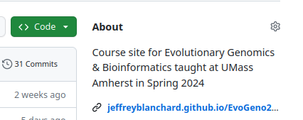
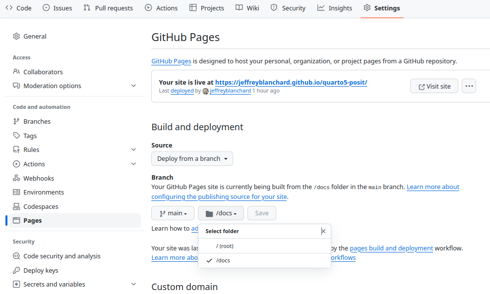
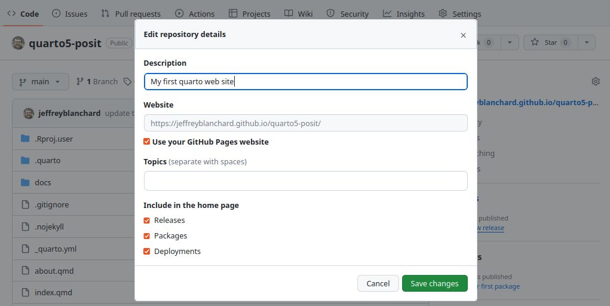
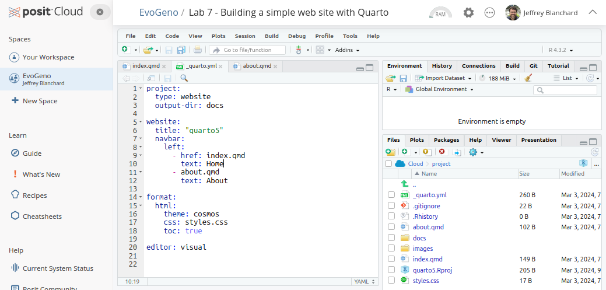

## Learning Objectives

In this lesson, you will learn:

- About the emerging Quarto presentation, publication and web site system
- Differences between R Markdown `Rmd` and Quarto `qmd` files
- How to make a Quarto web site on GitHub

## Background

[Quarto](https://quarto.org/) has recently been developed as a next-generation, R Markdown-like publishing system. Quarto was developed to be used with R, Python, Julia, and Observable JavaScript. You can easily work with Quarto in RStudio and can use Quarto in other popular editors including Visual Studio Code. Quarto has particular strengths related to [authoring tools](https://quarto.org/docs/guide/) for presentations, publiations and web sites. 

Today we will go through the background information on the [Quarto](https://quarto.org/) and look at a few differences between R Markdown `Rmd` and Quarto `qmd` files by going through the [NCEAS Literate Analysis with Quarto](https://learning.nceas.ucsb.edu/2023-10-coreR/session_04.html) chapter.


# On the Computer

## Making your first Quarto web site on Github

I make my [research group's website](https://jeffreyblanchard.github.io/lab/) using a tutorial from Nick Lyons [Building a website with Quarto](https://nceas.github.io/scicomp.github.io/tutorials.html#building-a-website-with-quarto). This is a good starting place if you are doing this on your own computer or using Unity. On Posit Cloud it is not possible to create a new Quarto website template, so I created a starter template similar to the Quarto default in the Lab 7 assignment. Today we are going to `Push` the template to a new GitHub repo and then add in changes to the site.

###  On the github website

__DO NOT CHANGE ANY FILES IN THE docs FOLDER__

* On your github site create a new repo by clicking on the new repository button.
* Give it a name, make it public, __DO NOT__ Add a readme file, a .gitignore file or a license.
* Click on the green `code` button and copy the https link.


### Lab 7 Posit Project
* Check out and open a Lab 7 Posit project

#### In the R Console (bottom left)
* In the R __Console__ Add your git credentials with the `usethis` package and your token begining with `ghp...`

```{r, eval=FALSE}
library(usethis)
use_git_config(user.name = "janedoe", user.email = "jane@example.org")
gitcreds::gitcreds_set() 
```

If you have forgotten your token. Create a new token using

```{r, eval=FALSE}
library(usethis)
usethis::create_github_token()
```
#### In the Terminal Window (bottom left)
Now in the __Terminal__ window establish a connection to your github repo and make your first commit

```{r, eval=FALSE}
git remote set-url origin https://github.com/jeffreyblanchard/quarto5-posit.git
git add .
git commit -m "first commit"
git branch -M main
git push -u origin main
```

### Back in your Github repo

* Make sure the Lab 7 files have been pushed to your repo then
* Go to settings
* Select Pages
* Under Branch select `main` then `docs` then `Save`


* Go back to the repo
* Click on the wheel in the About section on the right
* Check the box next to `Use your GitHub Pages website


Your site should be ready in about 5 minutes

## Exercises

### Update your web site

* To the about.qmd file add a picture (put it in the images folder) and a short about you paragraph (you can copy and paste from LinkedIn). Render it to make sure it appears as you wish.

* Add three new tabs Labs, Project, Presentation in addition to Home and About by opening the about.qmd file and saving it as the nanme of the new tab. Write one sentence on each of the new pages

* In the _quarto.yaml file add the names on the new tab files and a header for the tab (the default in the title name).



* Click on the `Render` button to see your updated web site.

* `Commit` the changes and then `Push` them to your GitHub repo

* Turn in the link to your GitHub Pages Quarto site in Canvas.
