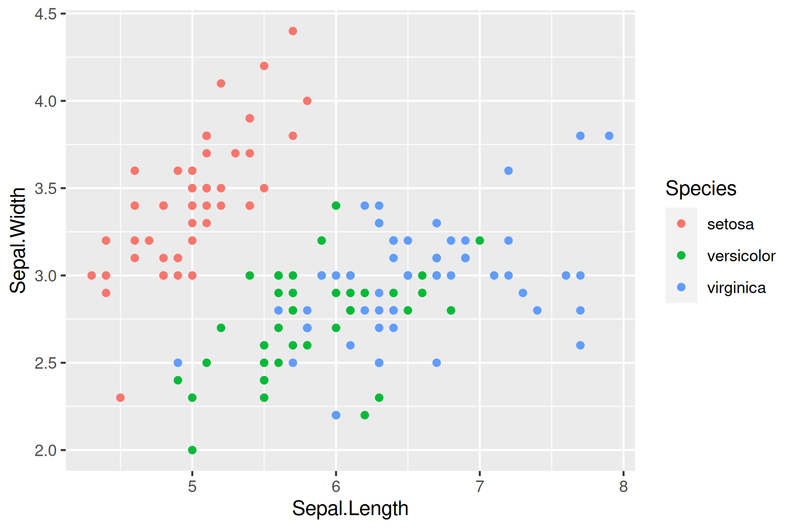

## Learning objectives

-   Be able to add title, axis labels, legends, colors to ggplot graphs
-   Resize graphs in RMarkdown
-   Print graphics to a file (e.g. jpeg, pdf)
-   Loading images into a RMarkdown file
-   Making interactive graphs and in RMarkdown

## Fine tuning ggplots

Today we will build upon the graphing approaches in the with all the [Data Carpentry ggplot tutorial](https://datacarpentry.org/R-ecology-lesson/04-visualization-ggplot2.html)

The <a href="http://www.cookbook-r.com/Graphs/">Cookbook for R by Winston Chang</a> is also great for tidying up our graphs. 

Here are a couple of cheat sheets that can be useful

-   <a href="http://www.rstudio.com/wp-content/uploads/2015/12/ggplot2-cheatsheet-2.0.pdf">R Studio ggplot2 cheatsheet</a>
-   <a href="https://rstudio.com/wp-content/uploads/2016/03/rmarkdown-cheatsheet-2.0.pdf">RMarkdown cheatsheet</a>

### First load the libraries

```{r, warning=FALSE}
library(tidyverse)
library(plotly)
```

### Basic graph labels

```{r, fig.height=3, fig.width=5}
  ggplot(data = iris, aes(x = Sepal.Length, y = Sepal.Width)) +
    geom_point(aes(color=Species, shape=Species)) +
    labs(title = "Iris Sepal Length vs Wide", x = "Sepal Length", y = "Sepal Width", color = "Plant Species", shape = "Plant Species") 
```


### Themes

https://r-charts.com/ggplot2/themes/

```{r, fig.height=3, fig.width=5}
  ggplot(data = iris, aes(x = Sepal.Length, y = Sepal.Width)) +
    geom_point(aes(color=Species, shape=Species)) +
    labs(title = "Iris Sepal Length vs Wide", x = "Sepal Length", y = "Sepal Width", color = "Plant Species", shape = "Plant Species") +
  theme_classic()
```

### Colors


```{r, fig.height=3, fig.width=5}
  ggplot(data = iris, aes(x = Sepal.Length, y = Sepal.Width)) +
    geom_point(color = "red", aes(shape = Species))+
    labs(title = "Iris Sepal Length vs Wide", x = "Sepal Length", y = "Sepal Width") 
```

```{r, fig.height=3, fig.width=5}
  ggplot(data = iris, aes(x = Sepal.Length, y = Sepal.Width)) +
    geom_point(aes(color = Species, shape = Species)) +
    scale_color_manual(values=c("blue", "purple", "red")) +
    labs(title = "Iris Sepal Length vs Wide", x = "Sepal Length", y = "Sepal Width") 
```

```{r, fig.height=3, fig.width=5}
  ggplot(data = iris, aes(x = Sepal.Length, y = Sepal.Width)) +
    geom_point(aes(color = Species, shape = Species)) +
    scale_color_brewer(palette="Dark2") +
    labs(title = "Iris Sepal Length vs Wide", x = "Sepal Length", y = "Sepal Width") 
```
```{r, fig.height=3, fig.width=5}
library(viridisLite)
  ggplot(data = iris, aes(x = Sepal.Length, y = Sepal.Width)) +
    geom_point(aes(fill = Species), color = "black", pch=21) +
    labs(title = "Iris Sepal Length vs Wide", x = "Sepal Length", y = "Sepal Width") 
```

https://sjmgarnier.github.io/viridisLite/

```{r, fig.height=3, fig.width=5}
library(viridisLite)
  ggplot(data = iris, aes(x = Sepal.Length, y = Sepal.Width)) +
    geom_point(aes(color = Species, shape = Species)) +
    scale_colour_viridis_d() +
    labs(title = "Iris Sepal Length vs Wide", x = "Sepal Length", y = "Sepal Width") 
```

### Controlling graph size in RMarkdown

In the opening line of the RMarkdown code chunk {r} you can control the output of the code, graphs, tables using knitr syntax. For example if {r, eval = FALSE} the code will not be run, but will be shown. If {r, code = FALSE} the code will not be shown, but will be run and the output will be shown (useful in reports where the reader is only interested in the results/graphs, but not the code). You can also suppress error messages and warnings so that the reader isn't bothered by them (but you should take notice). YOU CAN ALSO DO THIS NOW IN THE VISUAL EDITOR MODE IN RSTUDIO.

The dimensions of an individual graph in the RMarkdown document be adjusted by specifying the graph dimensions in the header for the r code chunk

__```{r, fig.width = 8, fig.height = 2}__

### Graphic Output

You may have realized that you can export plots in R Studio by clicking on Export in the Plots window that appears after you make a graph. You can save as a pdf, svg, tiff, png, bmp, jpeg and eps. You can also write the output directly to a file. This is particularly useful for controling the final dimensions in a reproducible way and for manuscripts.

-   <a href="http://www.cookbook-r.com/Graphs/Output_to_a_file/">Cookbook for R - Output to a file - PDF, PNG, TIFF, SVG </a>


```{r}
# Plot graph to a pdf outputfile
pdf("images/iris_example_plot1.pdf", width=6, height=3)
ggplot(data = iris, aes(x = Sepal.Length, y = Sepal.Width, color = Species)) + 
  geom_point() +
  labs(title = "Iris Sepal Length vs Wide", x = "Sepal Length", y = "Sepal Width") 
dev.off()
```

```{r}
# Plot graph to a png outputfile
ppi <- 300
png("images/iris_example_plot2.png", width=6*ppi, height=4*ppi, res=ppi)
ggplot(data = iris, aes(x = Sepal.Length, y = Sepal.Width, color = Species)) + 
  geom_point()
dev.off()
```

For more details on sizing output <a href="http://www.cookbook-r.com/Graphs/Output_to_a_file/">Cookbook for R - Output to a file - PDF, PNG, TIFF, SVG </a>

### RMarkdown loading images

Sometimes it is useful in controlling the image layout for a report to file with the graph and then subsequently load it into the .Rmd file. This works with png files, but not pdfs. You can also upload images made with other bioinformatic tools into your RMarkdown report.

```{r eval = FALSE}
# This is the RMarkdown style for inserting images
# Your image must be in your working directory
# This command is put OUTSIDE the r code chunk

 
```



Another way to present a graph without the code is adding echo = FALSE within the r{} chunk - {r echo = FALSE}. This prevents code, but not the results from appearing in the knitr file.

### Interactive graphs in RMarkdown reports

With plotly/ggplotly (<https://plot.ly/ggplot2/>) you can make interactive graphs in your lab report.

```{r}
library(plotly)
```


```{r, message=FALSE}
# Version 1
ggplotly(
  ggplot(data = iris, aes(x = Sepal.Length, y = Sepal.Width, color = Species)) + 
    geom_point()
 )
```

```{r, message=FALSE, eval=FALSE}
# Version 2
p <- ggplot(data = iris, aes(x = Sepal.Length, y = Sepal.Width, color = Species)) + 
  geom_point()
ggplotly(p)
```

## Examples with the NEON data

First load the libraries

```{r, warning=FALSE}
library(tidyverse)
library(plotly)
```

Let's load the table into R

```{r, warning=FALSE, message=FALSE}
NEON_MAGs <- read_csv("data/NEON/GOLD_Study_ID_Gs0161344_NEON.csv") %>% 
  # remove columns that are not needed for data analysis
  select(-c(`GOLD Study ID`, `Bin Methods`, `Created By`, `Date Added`)) %>% 
  # create a new column with the Assembly Type
  mutate("Assembly Type" = case_when(`Genome Name` == "NEON combined assembly" ~ `Genome Name`,
                            TRUE ~ "Individual")) %>% 
  mutate_at("Assembly Type", str_replace, "NEON combined assembly", "Combined") %>% 
  separate(`GTDB-Tk Taxonomy Lineage`, c("Domain", "Phylum", "Class", "Order", "Family", "Genus"), "; ", remove = FALSE) %>% 
  # Get rid of the the common string "Soil microbial communities from "
  mutate_at("Genome Name", str_replace, "Terrestrial soil microbial communities from ", "") %>% 
  # Use the first `-` to split the column in two
  separate(`Genome Name`, c("Site","Sample Name"), " - ") %>% 
  # Get rid of the the common string "S-comp-1"
  mutate_at("Sample Name", str_replace, "-comp-1", "") %>%
  # separate the Sample Name into Site ID and plot info
  separate(`Sample Name`, c("Site ID","subplot.layer.date"), "_", remove = FALSE,) %>% 
  # separate the plot info into 3 columns
  separate(`subplot.layer.date`, c("Subplot", "Layer", "Date"), "-") 
```

Remove Archaea since there is no GTDB annotation for Archaea
Remove the coassembly data for today

```{r}
NEON_MAGs_bact_ind <- NEON_MAGs %>% 
  filter(Domain == "Bacteria") %>% 
  filter(`Assembly Type` == "Individual") 
```

### Bar plots

#### Counts produced by ggplot

Note that in this graph ggplot produces the count automatically

```{r}
NEON_MAGs_bact_ind %>% 
ggplot(aes(x = Phylum)) +
  geom_bar() +
  coord_flip()
```

Use the `forcats` package in tidyverse to put the counts in descending order

```{r}
NEON_MAGs_bact_ind %>% 
ggplot(aes(x = fct_infreq(Phylum))) +
  geom_bar() +
  coord_flip()
```
#### Counts passed to ggplot

This is different code that creates the same graph as above. Note in this case the counts were first calculated in `dplyr` then passed to ggplot. Both x and y values are needed. Within `geom_bar` `stat` is set to "identify"

```{r}
NEON_MAGs_bact_ind %>% 
  count(Phylum) %>% 
ggplot(aes(x = Phylum, y = n)) +
  geom_col(stat = "identity") +
  coord_flip()
```

To put in descending order

```{r}
NEON_MAGs_bact_ind %>% 
  count(Phylum) %>% 
ggplot(aes(x = reorder(Phylum, n), y = n)) +
  geom_col(stat = "identity") +
  coord_flip()
```


#### Stacked vs multiple bar plots

```{r}
NEON_MAGs_bact_ind %>% 
ggplot(aes(x = fct_rev(fct_infreq(Phylum)), fill = Site)) +
  geom_bar() +
  coord_flip()
```

```{r, fig.width = 10, fig.height= 8}
NEON_MAGs_bact_ind %>% 
ggplot(aes(x = fct_rev(fct_infreq(Phylum)), fill = Site)) +
  geom_bar(position = "dodge") +
  coord_flip()
```
Notice that the bars are of different width. This can be adjusted by setting the width

```{r, fig.width = 10, fig.height= 8}
NEON_MAGs_bact_ind %>% 
ggplot(aes(x = fct_rev(fct_infreq(Phylum)), fill = Site)) +
  geom_bar(position = position_dodge2(width = 0.9, preserve = "single")) +
  coord_flip()
```
### Multiple panels (facet_wrap)

```{r, fig.width = 10, fig.height= 16}
NEON_MAGs_bact_ind %>% 
ggplot(aes(x = Phylum)) +
  geom_bar(position = position_dodge2(width = 0.9, preserve = "single")) +
  coord_flip() +
  facet_wrap(vars(Site), scales = "free", ncol = 2)
```

### Histogram

```{r}
NEON_MAGs_bact_ind %>% 
ggplot(aes(x = `Total Number of Bases`)) +
  geom_histogram(bins = 50) 
```

### Box plot

```{r}
NEON_MAGs_bact_ind %>%   
ggplot(aes(x = fct_infreq(Phylum), y = `Total Number of Bases`)) +
  geom_boxplot() +
  theme(axis.text.x = element_text(angle=45, vjust=1, hjust=1))
```

### Showing each point in the above plot

```{r}
NEON_MAGs_bact_ind %>%   
ggplot(aes(x = fct_infreq(Phylum), y = `Total Number of Bases`)) +
  geom_point() +
  coord_flip()
```

## Exercises

For all exercises make complete graphs that are report ready. Relabel the x-axis, y-axis and legend for clarity, add a title, add color and size appropriately. The `NA`s in the taxonomy indicate a novel species starting with the highest level.  For example a `NA` in a class that has an assigned phylum `Proteobacteria` would be a novel class in the phylum `Proteobacteria`.

### Exercise 1

What are the overall class MAG counts?

### Exercise 2

What are the MAG counts for each subplot. Color by site ID.

### Exercise 3

How many novel bacteria were discovered (Show that number of `NA`s for each taxonomic level)?

### Exercise 4

How many novel bacterial MAGs are high quality vs medium quality?

### Exercise 5

What sites have novel bacterial genera?

### Exercise 6

What phyla have novel bacterial genera?

### Exercise 7

Make a stacked bar plot of the total number of MAGs at each site using Phylum as the fill.

### Exercise 8

Using `facet_wrap` make plots of the total number of MAGs at each site for each phylum (e.g. similar to the example above but using the site ID and separating each graph by phylum.)

### Exercise 9

What is the relationship between MAGs genome size and the number of genes? Color by Phylum.

### Exercise 10

What is the relationship between scaffold count and MAG completeness?


